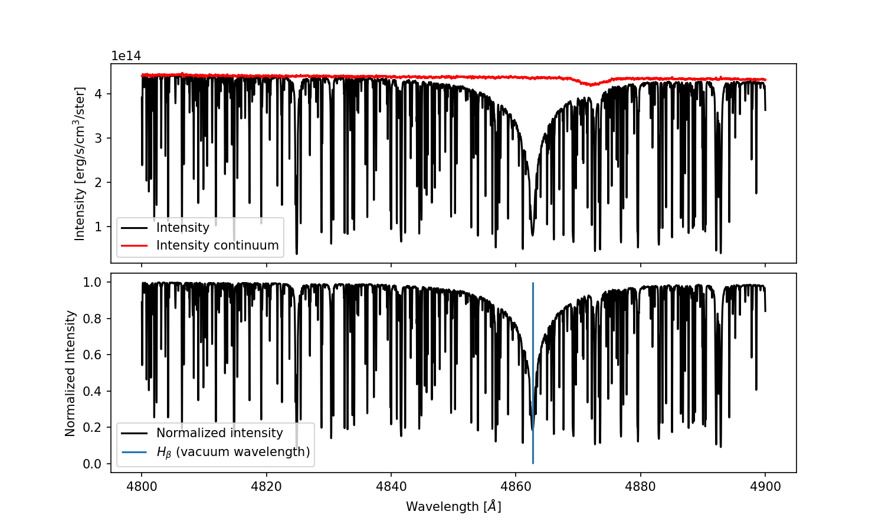

# Transformer Payne

  [](reports/junit/junit.xml) [](reports/coverage/coverage.xml)

---

Tomasz Różański, Yuan-Sen Ting and Maja Jabłońska, "Toward a Spectral Foundation Model: An Attention-Based Approach with Domain-Inspired Fine-Tuning and Wavelength Parameterization", https://arxiv.org/abs/2306.15703

---

## Example usage:
```
import transformer_payne as tp
import numpy as np
import matplotlib.pyplot as plt

emulator = tp.TransformerPayne.download() # Download weights for default emulator

wave = np.linspace(4800, 4900, 10000)
mu = 1.0 # Ray perpendicular to solar surface
parameters = emulator.solar_parameters # Pick solar parameters and abundances

spectrum = emulator(np.log10(wave), mu, parameters) # Emulate a spectrum
```

Visulize the results:

```
intensity = spectrum[:,0]
continuum = spectrum[:,1]
normalized_intensity = intensity / continuum

fig, axs = plt.subplots(2, sharex=True, figsize=(5, 4))
axs[0].plot(wave, intensity, color='black', label='Intensity')
axs[0].plot(wave, continuum, color='red', label='Intensity continuum')
axs[1].plot(wave, normalized_intensity, label="Normalized intensity", color='black')
axs[1].vlines(4862.721, 0, 1, color='C0', label=r'$H_\beta$ (vacuum wavelength)')  # Using raw string for LaTeX
axs[1].set_xlabel("Wavelength [$\AA$]")  # Corrected to set xlabel on the second subplot
axs[0].set_ylabel("Intensity [erg/s/cm$^3$/ster]")
axs[1].set_ylabel("Normalized Intensity")
axs[0].legend(loc="lower left")
axs[1].legend(loc="lower left")
plt.subplots_adjust(hspace=0.05)
plt.show()
```


## Installation

### Installation using pip

Install transformer-payne with `huggingface-hub` and `joblib` modules that allow you to easily download the model weights from the internet. Check that you are also having a `matplotlib` and `numpy` installed so you could run the example given above.

```
pip install transformer-payne
pip install huggingface-hub joblib numpy matplotlib
```

### Developer installation from local repository

```
git clone https://github.com/RozanskiT/transformer_payne.git
cd transformer_payne
pip install -e .[dev]
```

---

## Available Emulators

### MARCS, Korg.jl and Kurucz's linelist - default intensity emulator
This document outlines an emulator built upon the slightly adopted Korg.jl package and MARCS stellar atmosphere grid. It simulates stellar spectra across a broad parameter space:

- Effective Temperature (Teff): 4000 - 8000 K
- Surface Gravity (logg): 2.0 - 5.0
- Microturbulence (vmic): 0 - 5 km/s
- Metallicity ([Fe/H]): -2.5 to 1.0
- Alpha-element Enhancement ([alpha/Fe], ): -1.0 to 1.0
- Carbon-to-Iron Ratio ([C/Fe]): -1.0 to 1.0
- Elemental Abundances: Individual abundances can vary within a logarithmic range of ±0.3, from Helium to Uranium (with respect to given [Fe/H], [alpha/Fe] and [C/Fe])
- Resolution: ~300000

The emulator employs the latest Kurucz line list (gfall08oct17), covering a wavelength range of 3000 - 11000 angstroms. For more information, visit the following links:

- Korg.jl: [link](https://github.com/ajwheeler/Korg.jl)
- Kurucz Line Lists: [link](http://kurucz.harvard.edu/linelists.html)
- MARCS Grid: [link](https://dr17.sdss.org/sas/dr17/apogee/spectro/speclib/atmos/marcs/MARCS_v3_2016/Readme_MARCS_v3_2016.txt)

### Work in progress...
